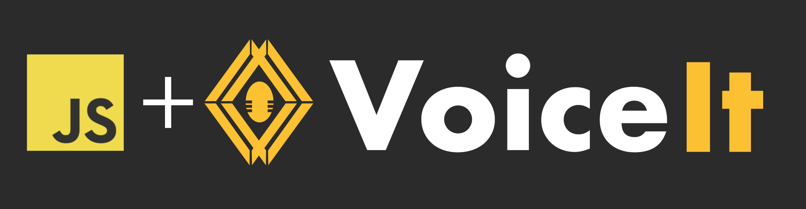
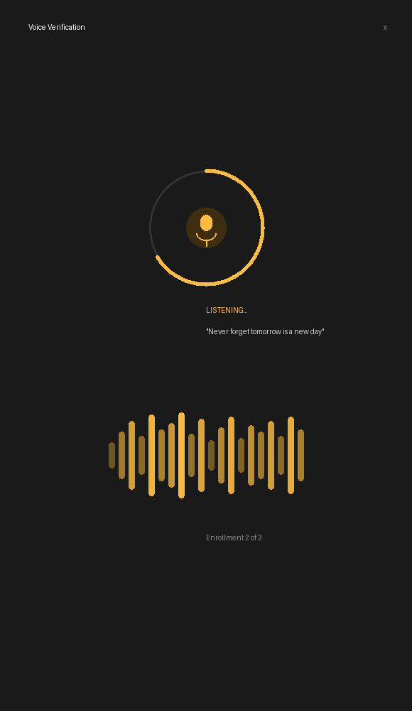
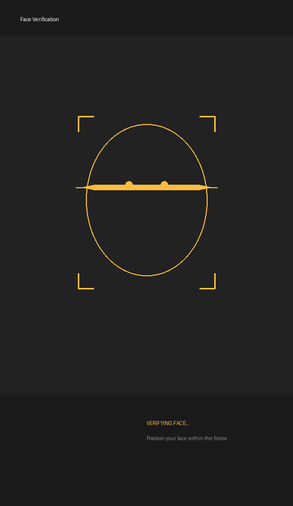
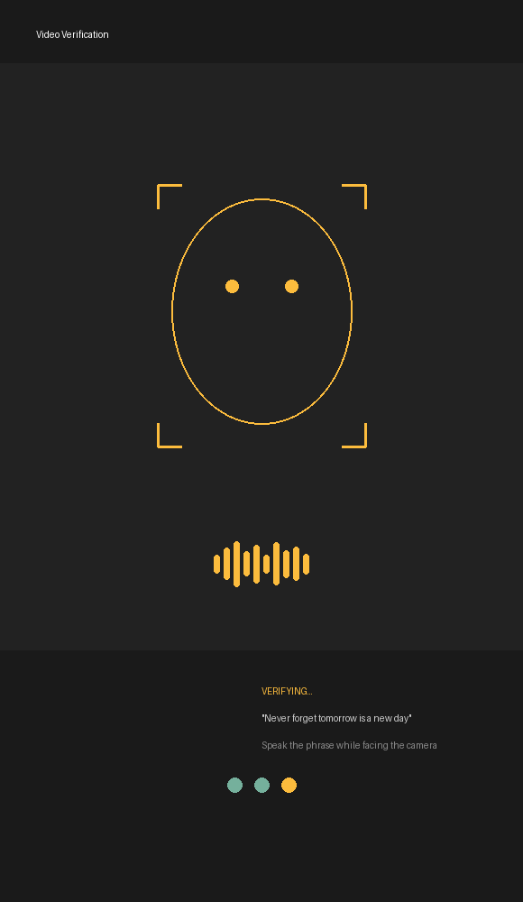
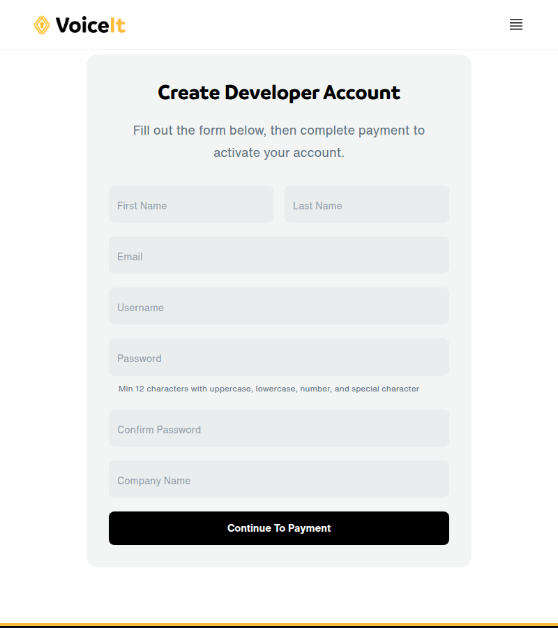
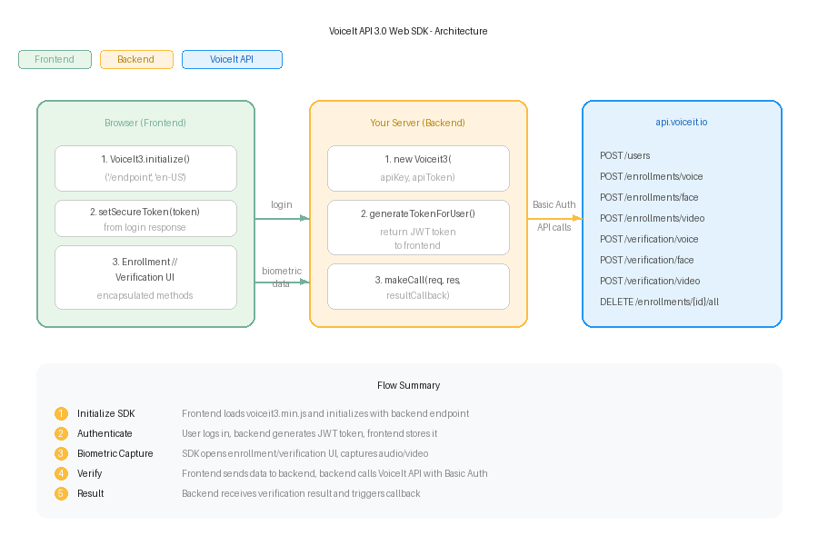

# VoiceIt API 3.0 Web SDK

The repository contains an example [web demonstration](#web-example) of VoiceIt's API 3.0 in the browser with a PHP or NodeJS backend. Please navigate to [Incorporating the SDK](#incorporating-the-sdk) for instructions on how to integrate the SDK into your own project(s).

* [Prerequisites](#prerequisites)
* [Supported Browsers](#supported-browsers)
* [Web Example](#web-example)
  * [UI Screenshots](#ui-screenshots)
  * [Getting Started](#getting-started)
    * [The Config File](#the-config-file)
    * [Making Changes to the Frontend](#making-changes-to-the-frontend)
    * [Running the Example](#running-the-example)
* [Incorporating the SDK](#incorporating-the-sdk)
  * [Backend Implementation](#backend-implementation)
    * [Initializing the Base Module](#initializing-the-base-module)
    * [Getting the Result](#getting-the-result)
    * [Generating a Secure Token](#generating-a-secure-token)
  * [Frontend Implementation](#frontend-implementation)
    * [Initializing the Frontend](#initializing-the-frontend)
    * [Setting Theme Color](#setting-theme-color)
    * [Setting the Secure Token](#setting-the-secure-token)
    * [Enrollment and Verification Methods](#enrollment-and-verification-methods)
  * [Implementation Diagram](#implementation-diagram)
  * [Content Languages](#changing-the-content-language)
* [Getting Help](#getting-help)

## Prerequisites
* PHP 5.0 or greater or Node 8.0 or greater
* PHP compatible server such as Apache for the PHP backend

## Supported Browsers

**Desktop:**
* Google Chrome 14+
* Firefox 25+
* Opera 15+
* Safari 6+
* Microsoft Edge 12+

**Mobile:**
* Google Chrome for Android 29+
* Safari 6+ (has restrictions on use)
* Firefox 25+

## UI Screenshots

The following show Voice Verification, Face Verification, and Video Verification, respectively.

<div style="background: #000 !important;">
  
</div>

## Web Example

### Getting Started

Sign up at [voiceit.io/pricing](https://voiceit.io/pricing) to get your API Key and Token, then log in to the [Dashboard](https://dashboard.voiceit.io) to manage your account.



#### The Config File

##### PHP
Navigate to `VoiceIt3-WebSDK/voiceit3-php-server-example/config.php`. Replace `API_KEY_HERE` with your API Key, `API_TOKEN_HERE` with your API Token, and `TEST_USER_ID_HERE` with a userId.

##### NodeJS
Navigate to `VoiceIt3-WebSDK/voiceit3-node-server-example/config.js`. Replace `API_KEY_HERE` with your API Key, `API_TOKEN_HERE` with your API Token, and `TEST_USER_ID_HERE` with a userId.

#### Making Changes to the Frontend
The frontend folder holds the source files, compiled using webpack into the voiceit3-dist folder. The script `compile.sh` compiles and transfers `voiceit3.min.js` to the Node and PHP examples.

```bash
./compile.sh
```

#### Setting the Content Language
To set the content language, navigate to the `index.js` file in the example server's public/js directory and set the language at line 1.

#### Running the Example

##### PHP
Start your server (Apache), pointing to `VoiceIt3-WebSDK/voiceit3-php-server-example` as the document root.

##### NodeJS
```bash
cd VoiceIt3-WebSDK/voiceit3-node-websdk && npm install
cd ../voiceit3-node-server-example && npm install
npm start
```

Visit your server at port 3000. Use `demo@voiceit.io` / `demo123` to log in. First complete enrollment(s), then test verification. You will need to grant microphone and camera permissions.

## Incorporating the SDK



Each type (voice, face, and video) and each action (enrollment and verification) can be implemented independently. A backend and frontend implementation is required.

### Backend Implementation

#### Initializing the Base Module

##### PHP
```php
require('voiceit3-php-websdk/VoiceIt3WebBackend.php');
$myVoiceIt = new VoiceIt3WebBackend("YOUR_API_KEY", "YOUR_API_TOKEN");

$voiceItResultCallback = function($jsonObj){
  $callType = $jsonObj["callType"];
  $userId = $jsonObj["userId"];
  if($jsonObj["jsonResponse"]["responseCode"] == "SUCC"){
    // User verified - start session
  }
};

$myVoiceIt->InitBackend($_POST, $_FILES, $voiceItResultCallback);
```

##### NodeJS
```javascript
const VoiceIt3WebSDK = require('voiceit3-node-websdk');
const multer = require('multer')();

app.post('/example_endpoint', multer.any(), function (req, res) {
  const myVoiceIt = new VoiceIt3WebSDK.Voiceit3("YOUR_API_KEY", "YOUR_API_TOKEN", {
    tempFilePath: "/tmp/"
  });
  myVoiceIt.makeCall(req, res, function(jsonObj){
    const callType = jsonObj.callType.toLowerCase();
    const userId = jsonObj.userId;
    if(jsonObj.jsonResponse.responseCode === "SUCC"){
      // User verified - start session
    }
  });
});
```

#### Getting the Result
After verification, the callback receives:

```json
{
  "callType": "faceVerification",
  "userId": "usr_********************",
  "jsonResponse": {
    "faceConfidence": 100,
    "message": "Successfully verified face for user",
    "timeTaken": "2.249s",
    "responseCode": "SUCC",
    "status": 200
  }
}
```

#### Generating a Secure Token

##### PHP
```php
require('voiceit3-php-websdk/VoiceIt3WebBackend.php');
$myVoiceIt = new VoiceIt3WebBackend("YOUR_API_KEY", "YOUR_API_TOKEN");
$createdToken = $myVoiceIt->generateTokenForUser($VOICEIT_USERID);

echo json_encode([
  "ResponseCode" => "SUCC",
  "Token" => $createdToken
]);
```

##### NodeJS
```javascript
const VoiceIt3WebSDK = require('voiceit3-node-websdk');

app.get('/login', function (req, res) {
  const createdToken = VoiceIt3WebSDK.generateTokenForUser({
    userId: VOICEIT_USERID,
    token: "YOUR_API_TOKEN",
    sessionExpirationTimeHours: 1
  });

  res.json({
    'ResponseCode': 'SUCC',
    'Token': createdToken
  });
});
```

### Frontend Implementation

#### Initializing the Frontend

Include the minified JavaScript file:
```html
<script src='/voiceit3.min.js'></script>
```

Initialize:
```javascript
var myVoiceIt = new VoiceIt3.initialize('/example_endpoint/', 'en-US');
```

#### Setting Theme Color
```javascript
myVoiceIt.setThemeColor('#FBC132');
```

#### Setting the Secure Token
```javascript
myVoiceIt.setSecureToken('TOKEN_FROM_BACKEND');
```

#### Enrollment and Verification Methods

##### Voice Enrollment
```javascript
myVoiceIt.encapsulatedVoiceEnrollment({
  contentLanguage: 'en-US',
  phrase: 'never forget tomorrow is a new day',
  completionCallback: function(success, jsonResponse) {
    if (success) {
      alert('Voice Enrollments Done!');
    }
  }
});
```

##### Face Enrollment
```javascript
myVoiceIt.encapsulatedFaceEnrollment({
  completionCallback: function(success, jsonResponse) {
    if (success) {
      alert('Face Enrollment Done!');
    }
  }
});
```

##### Video Enrollment
```javascript
myVoiceIt.encapsulatedVideoEnrollment({
  contentLanguage: 'en-US',
  phrase: 'never forget tomorrow is a new day',
  completionCallback: function(success, jsonResponse) {
    if (success) {
      alert('Video Enrollments Done!');
    }
  }
});
```

##### Voice Verification
```javascript
myVoiceIt.encapsulatedVoiceVerification({
  contentLanguage: 'en-US',
  phrase: 'never forget tomorrow is a new day',
  needEnrollmentsCallback: function() {
    alert('A minimum of three enrollments are needed');
  },
  completionCallback: function(success, jsonResponse) {
    if (success) {
      alert('Successfully verified voice');
    }
  }
});
```

##### Face Verification
```javascript
myVoiceIt.encapsulatedFaceVerification({
  completionCallback: function(success, jsonResponse) {
    if (success) {
      alert('Successfully verified face');
    }
  }
});
```

##### Video Verification
```javascript
myVoiceIt.encapsulatedVideoVerification({
  contentLanguage: 'en-US',
  phrase: 'never forget tomorrow is a new day',
  needEnrollmentsCallback: function() {
    alert('A minimum of three enrollments are needed');
  },
  completionCallback: function(success, jsonResponse) {
    if (success) {
      alert('Successfully verified face and voice');
    }
  }
});
```

### Implementation Diagram


### Changing the Content Language

#### For PHP
Set at line 1 in `voiceit3-php-server-example/js/index.js`

#### For NodeJS
Set at line 1 in `voiceit3-node-server-example/public/js/index.js`

## Getting Help
Need help? Found a bug? Contact us at [support@voiceit.tech](mailto:support@voiceit.tech).
